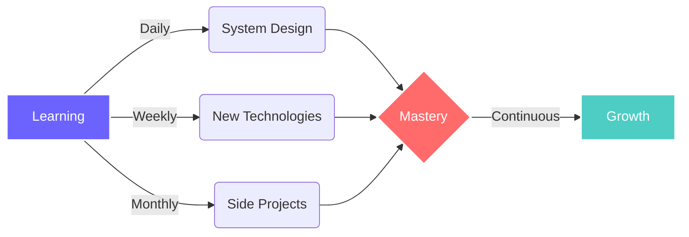

<div align="center">

<!-- Animated Header -->


<!-- Dynamic Typing Effect -->
<a href="https://git.io/typing-svg"></a>

</div>

<br/>

<!-- Profile Views Counter with Style -->
<div align="center">
  
  
  
</div>

---

## 🚀 About Me

```typescript
const developer = {
    name: "Your Name",
    role: "Full Stack Developer",
    location: "🌍 Earth",
    code: ["JavaScript", "TypeScript", "Python", "Java"],
    askMeAbout: ["web dev", "tech", "app dev", "clean code"],
    technologies: {
        frontEnd: {
            js: ["React", "Next.js", "Vue"],
            css: ["Tailwind", "Sass", "Styled Components"]
        },
        backEnd: {
            js: ["Node", "Express", "Nest.js"],
            python: ["Django", "Flask", "FastAPI"]
        },
        databases: ["MongoDB", "PostgreSQL", "MySQL", "Redis"],
        devOps: ["Docker", "AWS", "CI/CD", "Nginx"],
        tools: ["Git", "Figma", "Postman", "VS Code"]
    },
    architecture: ["Microservices", "Event-Driven", "Serverless", "MVC"],
    currentFocus: "Building scalable applications with clean architecture",
    funFact: "I debug with console.log and I'm proud of it 😄"
};
```

<br/>

---

## 💫 What I Do

<table>
<tr>
<td width="50%" valign="top">

### 🎨 Frontend Magic
- Crafting pixel-perfect, responsive UIs
- Implementing smooth animations & interactions
- Building component libraries & design systems
- Ensuring accessibility & performance optimization

</td>
<td width="50%" valign="top">

### ⚙️ Backend Wizardry
- Designing RESTful & GraphQL APIs
- Database architecture & optimization
- Authentication & authorization systems
- Microservices & scalable architecture

</td>
</tr>
</table>

<br/>

---

## 🛠️ Tech Arsenal

<div align="center">

### Languages


### Frontend


### Backend


### Database


### DevOps & Tools


</div>

<br/>

---

## 📊 GitHub Analytics

<div align="center">
  
  
  
  

</div>

<div align="center">
  
  
  
</div>

<br/>

<div align="center">
  
  
  
</div>

<br/>

---

## 🏆 GitHub Trophies

<div align="center">
  
  
  
</div>

---

## 🎯 Current Focus

<div align="center">



</div>

<table align="center">
<tr>
<td align="center" width="33%">

<br><strong>Clean Code</strong>
<br>Writing maintainable code
</td>
<td align="center" width="33%">

<br><strong>Performance</strong>
<br>Optimizing for speed
</td>
<td align="center" width="33%">

<br><strong>Collaboration</strong>
<br>Working with teams
</td>
</tr>
</table>

---

## 💼 Experience Highlights

<details>
<summary><b>🚀 Full Stack Development</b></summary>
<br>

- 🔹 Built scalable web applications serving thousands of users
- 🔹 Implemented RESTful APIs and GraphQL endpoints
- 🔹 Developed responsive UIs with modern frameworks
- 🔹 Integrated third-party services and payment gateways
- 🔹 Optimized database queries and application performance

</details>

<details>
<summary><b>👥 Team Collaboration</b></summary>
<br>

- 🔹 Daily stand-ups and sprint planning
- 🔹 Code reviews and pair programming
- 🔹 Git workflow and version control
- 🔹 Agile methodology and project management
- 🔹 Technical documentation and knowledge sharing

</details>

<details>
<summary><b>🎨 UI/UX Implementation</b></summary>
<br>

- 🔹 Pixel-perfect implementation from designs
- 🔹 Responsive and mobile-first approach
- 🔹 Accessibility standards (WCAG)
- 🔹 Cross-browser compatibility
- 🔹 Performance optimization

</details>

---

## 🌟 Featured Projects

<!-- Project Cards -->
<div align="center">

<table>
<tr>
<td width="50%">

<h3 align="center">Project Name 1</h3>

<div align="center">  
<a href="https://github.com/yourusername/project1">

</a>

<p>
<a href="https://github.com/yourusername/project1">

</a>
<a href="https://project1-demo.com">

</a>
</p>

<p><strong>React, Node.js, MongoDB</strong> - Brief description of what this amazing project does and the problems it solves.</p>
</div>

</td>
<td width="50%">

<h3 align="center">Project Name 2</h3>

<div align="center">  
<a href="https://github.com/yourusername/project2">

</a>

<p>
<a href="https://github.com/yourusername/project2">

</a>
<a href="https://project2-demo.com">

</a>
</p>

<p><strong>Next.js, TypeScript, PostgreSQL</strong> - Brief description of what this amazing project does and the problems it solves.</p>
</div>

</td>
</tr>
</table>

</div>

---

## 📝 Latest Blog Posts

<!-- BLOG-POST-LIST:START -->
- 🚀 [Building Scalable Microservices with Node.js](#)
- 🎨 [Modern CSS Techniques for 2024](#)
- ⚡ [Optimizing React Performance](#)
- 🔐 [Authentication Best Practices](#)
<!-- BLOG-POST-LIST:END -->

---

## 🤝 Let's Connect!

<div align="center">

<a href="https://linkedin.com/in/yourprofile">

</a>
<a href="https://twitter.com/yourhandle">

</a>
<a href="mailto:your.email@example.com">

</a>
<a href="https://yourportfolio.com">

</a>
<a href="https://dev.to/yourusername">

</a>

</div>

<br/>

<div align="center">

### 💬 "Code is like humor. When you have to explain it, it's bad." – Cory House

</div>

<br/>

---

<div align="center">

### Show some ❤️ by starring some of the repositories!

</div>

<div align="center">
  
### 🌟 Fun Fact
  


</div>

---

<div align="center">

### 📈 Contribution Snake

<picture>
  <source media="(prefers-color-scheme: dark)" srcset="https://raw.githubusercontent.com/yourusername/yourusername/output/github-contribution-grid-snake-dark.svg">
  <source media="(prefers-color-scheme: light)" srcset="https://raw.githubusercontent.com/yourusername/yourusername/output/github-contribution-grid-snake.svg">
  
</picture>

</div>

---

<div align="center">


**⭐️ From [yourusername](https://github.com/yourusername) with 💙**

</div>
